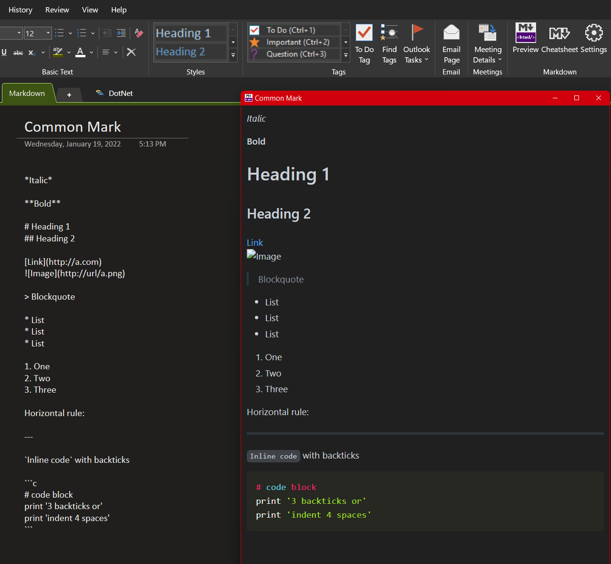
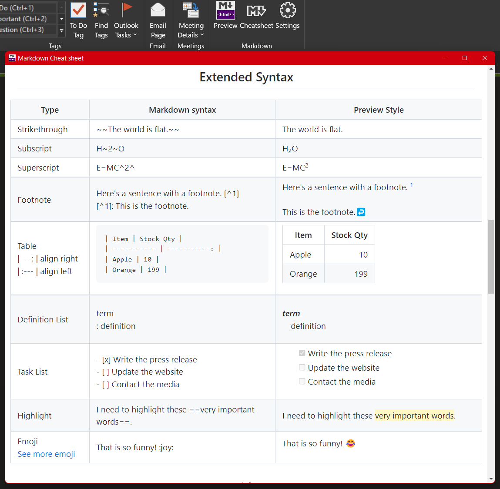

# OneNote Widget AddIn


A full featured Markdown viwer with syntax highlighting, export enhancement for OneNote

# Features

## Markdown Viewer
- Powered by [Markdig](https://github.com/lunet-io/markdig) - A powerful markdown parser, recommended by Microsoft
- CommonMark and GitHub flavored Markdown
- Syntax highlighting support
  - 100+ languages supported
- Dark/Light color scheme and code highlight theme support
  - Theme auto detection (following OS theme setting)
  - Multiple code highlight themes
- [Mermaid](https://github.com/mermaid-js/mermaid) chart support
  - Process, sequence, Gantt diagram etc. 
- Capturing picture in onenote page and display in Markdown viewer
## Markdown CheatSheet
- Common mark
- Extended mark
- Diagram
  - Mermaid charts
## Export enhancement
- Export for Notebook/Section Group/Section/Page
- Single File and Hierarchical files options


## Demos 
**Syntax highlighting**  
```
    ```csharp
    namespace Demo
    {
        public class MyDemo
        {
            public static void Main(string[] args)
            {
                Console.WriteLine("Hello World!");
            }
        }
    }
    ```
``` 
*Markdown preview:*
```csharp
    namespace Demo
    {
        public class MyDemo
        {
            public static void Main(string[] args)
            {
                Console.WriteLine("Hello World!");
            }
        }
    }
```
**Mermaid gantt chart**
```
    ```mermaid
    gantt
    section Section
    Completed :done,    des1, 2014-01-06,2014-01-08
    Active        :active,  des2, 2014-01-07, 3d
    Parallel 1   :         des3, after des1, 1d
    Parallel 2   :         des4, after des1, 1d
    Parallel 3   :         des5, after des3, 1d
    Parallel 4   :         des6, after des4, 1d
    ```
```  
*Markdown preview:*
[](https://mermaid-js.github.io/mermaid-live-editor/edit#eyJjb2RlIjoiZ2FudHRcbnNlY3Rpb24gU2VjdGlvblxuQ29tcGxldGVkIDpkb25lLCAgICBkZXMxLCAyMDE0LTAxLTA2LDIwMTQtMDEtMDhcbkFjdGl2ZSAgICAgICAgOmFjdGl2ZSwgIGRlczIsIDIwMTQtMDEtMDcsIDNkXG5QYXJhbGxlbCAxICAgOiAgICAgICAgIGRlczMsIGFmdGVyIGRlczEsIDFkXG5QYXJhbGxlbCAyICAgOiAgICAgICAgIGRlczQsIGFmdGVyIGRlczEsIDFkXG5QYXJhbGxlbCAzICAgOiAgICAgICAgIGRlczUsIGFmdGVyIGRlczMsIDFkXG5QYXJhbGxlbCA0ICAgOiAgICAgICAgIGRlczYsIGFmdGVyIGRlczQsIDFkIiwibWVybWFpZCI6IntcbiAgXCJ0aGVtZVwiOiBcImRhcmtcIlxufSIsInVwZGF0ZUVkaXRvciI6dHJ1ZSwiYXV0b1N5bmMiOnRydWUsInVwZGF0ZURpYWdyYW0iOnRydWV9)

[More mermaid chart examples](https://mermaid-js.github.io/mermaid/#/examples)

### Preview snapshot


### Cheat Sheet snapshot

## License
Apache 2.0

